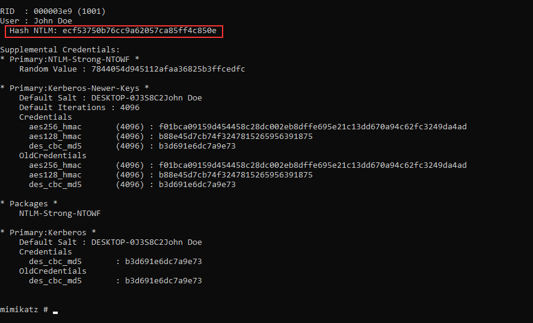
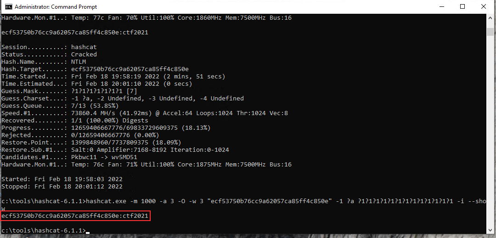

# Writeup - CyberDefenders AfricanFalls

- [Challenge](https://cyberdefenders.org/blueteam-ctf-challenges/66)

# Setup 

## Software 

- Flare VM 
- FTK Imager
- Autopsy
- Hashcat 

## Autopsy

1. Mount the image file in FTK Imager. 
2. Export Files.
3. Open a new Autopsy cade. 
4. Load the file directory as evience with default modules. 

# CTF Answers 

1. The txt file in the zip downloaded from CyberDefenders CTF cointains the MD5 hash. 
    1. `9471e69c95d8909ae60ddff30d50ffa1`
2. Found in Autopsy Web History Artifacts. 
    1. `password cracking lists`
3. Looked through the Run Programs prefetch data in Autopsy and found FileZilla, then found in filezilla.xml by looking through the xml file type View. 
    1. `192.168.1.20`
4. Found in Autopsy Recycle Bin and adjusted for UTC time. 
    1. `2021-04-29 18:22:17 UTC`
5. Looked through prefetch data, found no signs fo the browser being launched. 
    1. `0`
6. Found other signs of proton mail in Autopsy. The only pronton email address was the answer. 
    1. `dreammaker82@protonmail.com`
7. Nmap comes to mind when thinking about port scanning. Did a search for the word nmap, and eventually found an execution history with the domain. 
    1. `dfir.science`
8. Pull the lat long from the exif informaiton for the file and googled the location. 
    1. `Zambia`
9. If you look at the exif information you can see it was taken with a cellphone and the model is given. A little background knowledge would let you know that DCIM is where picutres are often stored on phones. I did a text search for DCIM and found a full path involing the string. 
    1. `Camera`
10. Using the hash analyze at <https://www.tunnelsup.com/hash-analyzer/> the hash was potentially identified as NTLM. I identified the parts of the NTLM hash <https://security.stackexchange.com/questions/161889/understanding-windows-local-password-hashes-ntlm> and used hashcat to crack the hash. I used hashcat on my host machine, not the Flare VM. 
    1. `hashcat.exe -m 1000 -a 3 -O -w 3 "3DE1A36F6DDB8E036DFD75E8E20C4AF4"  -1 ?a ?1?1?1?1?1?1?1?1?1?1?1?1 -i`
    2. `AFR1CA!`
11. We have access to the SAM and SYSTEM files that contain password hashes in C:\Windows\System32\Config. I'll dump the hashes with Mimikatz and the file export done with FTK imager.
    1. `mimikatz.exe`
    2. `lsadump::sam /system:"C:\forensicFiles\c48-Africanfalls\FTKexport\001Win10.e01_Partition 2 [50647MB]_NONAME [NTFS]\[root]\Windows\System32\config\SYSTEM" /sam:"C:\forensicFiles\c48-Africanfalls\FTKexport\001Win10.e01_Partition 2 [50647MB]_NONAME [NTFS]\[root]\Windows\System32\config\SAM"`
    4. 
    5. Then I'll crack the hash with hashcat. 
    6. NTLM Hash `ecf53750b76cc9a62057ca85ff4c850e`
    7. `hashcat.exe -m 1000 -a 3 -O -w 3 "ecf53750b76cc9a62057ca85ff4c850e"  -1 ?a ?1?1?1?1?1?1?1?1?1?1?1?1?1 -i`
    8. 
    9. `ctf2021`

