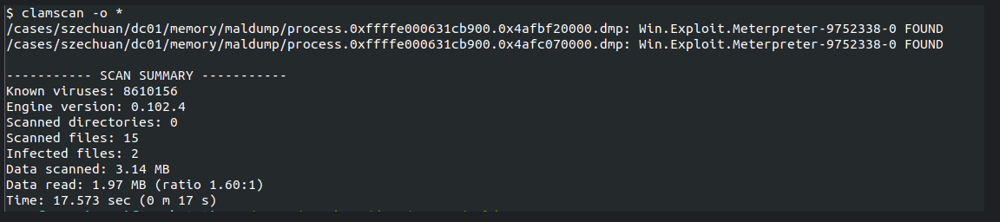

# Memory Forensic 

Using a memory dump from https://dfirmadness.com/case-001-memory-analysis/

## Tools 

- Volatility 2
- Volatility 3
- Rekall - fork of volatility 2 
- Redline

## Volatility 2 

### imageinfo
Get image info and output to file. Output will have color coding and can be read with color coding if commands are preceded with `unbuffer` which requires `excpect` to be installed. 

`vol.py -f citadeldc01.mem imageinfo | tee imageinfo.out`

### netscan

See all network connection in the image. This can be a lot of connections and can be trimmed up with a subsequent grep command. 

`vol.py -f citadeldc01.mem --profile=Win2012R2x64 netscan | tee netscan.out` 

remove DNS for less noisy output 

`grep -v dns.exe netscan.out | less`

#### TO DO 

- Look at the processes.
- Google Names of existing connections.

### malfind 

Malfind is a volatility module that looks at every process in memory and looks for hidden or injected code/dlss in user mode memory based on characterists such as VAD tag and page permissions. 

`vol.py -f citadeldc01.mem --profile=Win2012R2x64 malfind | tee malfind.out` 

#### TO DO 

- Look for sandwiches of code
- Look in hex for "MZ" and "DOS MODE" 

### maldump 

Malfind can carve and dump the processes into a directory. the files can then be examined with AV. 

- `vol.py -f citadeldc01.mem --profile=Win2012R2x64 malfind -D maldump/`
- `freshclam` - update ClamAV
- `clamscan -o *` - run Clam scan

#### TO DO 

- Copy any malicious files to their own directory 

### FLOSS 

FLOSS or FireEye Labs Obfuscated String Solver helps find malicious strings that are obfuscated in malicious PEs. This is Linux strings command on steroids.

`floss filename.dmp | tee output.out`

### PSTree 

`vol.py -f citadeldc01.mem --profile=Win2012R2x64 pstree | tee pstree.out`

#### Full Path 

`vol.py -f citadeldc01.mem --profile=Win2012R2x64 pstree -v | tee pstree.out`

### handles 

May give you an idea of what malware was trying to access. 

`vol.py -f citadeldc01.mem --profile=Win2012R2x64 handles | tee handles.out`

### hollowfind 

`vol.py -f citadeldc01.mem --profile=Win2012R2x64 hollowfind -D hollowfindDump/`

